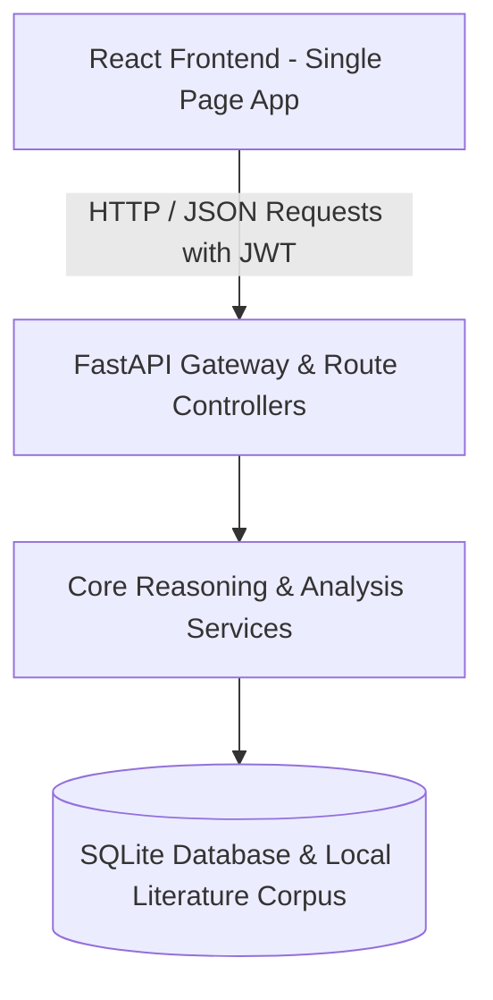
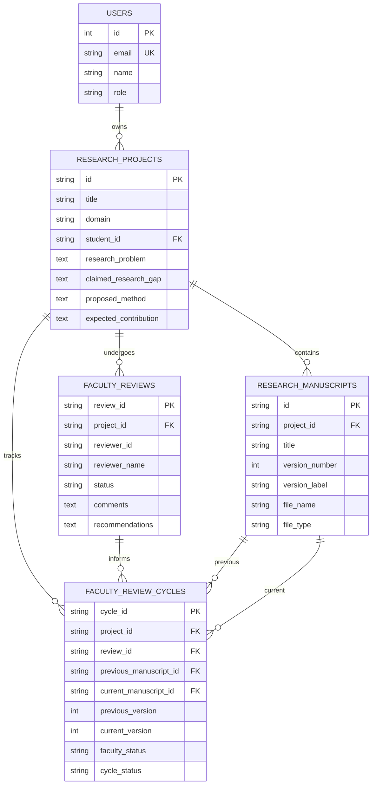

# GapGuard AI — System Architecture & Technical Specification

GapGuard AI is an explainable research integrity and decision-support system designed to assist academic researchers and faculty reviewers in validating claimed research gaps, differentiating proposed contributions against existing literature, auditing evidence coverage, and managing multi-cycle revision workflows.

---

## 1. High-Level Architectural Flow

### Layer Breakdown:
1. **Presentation Layer (Frontend)**:
   - Built with React 19, Vite, and Tailwind CSS.
   - Strictly isolated roles: Student/Researcher and Faculty/Professor.
   - Interactive components: Knowledge Graph canvas, 13-field Revision Comparison, Reasoning Workbench, and Chronological Review History.
2. **API & Gateway Layer (Backend)**:
   - Built with FastAPI (Python 3.8+).
   - Validates incoming request schemas using Pydantic models.
   - Enforces role-based permissions, JWT bearer authentication, and structured error responses.
3. **Reasoning & Business Logic Layer (Services)**:
   - Deterministic and rule-based academic evaluation engines.
   - Knowledge representation and search algorithms.
4. **Data Persistence & Corpus Layer**:
   - SQLite database (`academic_integrity.db`) storing user profiles, research projects, manuscript versions, and faculty review cycles.
   - JSON-indexed development literature corpus (`development_sample_corpus`).

---

## 2. Core Service Inventory & Responsibilities

| Service | Module | Key Responsibility |
| :--- | :--- | :--- |
| **Manuscript Text Extractor** | `manuscript_extractor.py` | Extracts plain text from `.pdf`, `.docx`, and `.txt` files without performing AI claims. |
| **Research Information Extractor** | `research_extractor.py` | Identifies and extracts 13 canonical academic sections (`problem`, `gap`, `method`, `contribution`, etc.). |
| **Literature Retrieval Engine** | `literature_corpus.py` | BM25 / TF-IDF search indexing retrieved papers against research queries. |
| **Research Gap Analyzer** | `gap_analyzer.py` | Relates claimed gaps to literature evidence; detects potential contradictions and corroborations. |
| **Contribution Differentiator** | `contribution_differentiator.py` | Evaluates proposed novel contributions across 6 dimensions of literature overlap. |
| **Knowledge Graph Builder** | `knowledge_graph.py` | Constructs concept networks linking project formulation to literature findings and limitations. |
| **Graph Search Engine** | `graph_search.py` | Implements Breadth-First Search (BFS), Depth-First Search (DFS), and Greedy Best-First Search. |
| **Rule-Based Inference Engine** | `rule_engine.py` | Executes forward and backward chaining over academic production rules with explanation traces. |
| **Bayesian Reasoner** | `bayesian_reasoner.py` | Computes model-based posterior evidence estimates $P(H\|E)$ using configured prior and likelihoods. |
| **Evidence Coverage Auditor** | `evidence_coverage.py` | Audits major manuscript claims against retrieved literature evidence (*Supported*, *Partial*, *Insufficient*). |
| **Revision Comparator** | `revision_comparator.py` | Performs deterministic 13-field semantic diff between two manuscript drafts of the same project. |
| **Submission Readiness Reporter** | `submission_readiness.py` | Synthesizes gap, contribution, evidence, and revision evaluations into a non-scoring pre-submission dashboard. |
| **Faculty Review Service** | `faculty_review.py` | Manages faculty reviews, qualitative section feedback, revision requests, and project review listings. |
| **Revision Cycle Tracker** | `faculty_review.py` | Connects manuscript versions (V1 $\rightarrow$ V2) and faculty feedback into a chronological research history. |

---

## 3. Database Schema & Relationships

---

## 4. Fundamental Academic Safeguards & Guardrails

GapGuard AI operates under strict ethical guidelines designed to empower researchers without creating deceptive automated judgments:

1. **Local Corpus Limitation**:
   *Every AI analysis is grounded solely in the literature currently indexed in the GapGuard development corpus.* It does not represent global literature search or scientific consensus.
2. **Non-Judgmental Workflow Statuses**:
   Statuses are workflow indicators (`Under Review`, `Revision Requested`, `Reviewed`), NEVER academic judgments (`Approved`, `Rejected`, `Passed`, `Failed`).
3. **No Numerical Quality or Novelty Scores**:
   The system intentionally produces **no** "research quality score", "novelty score", or "publication probability".
4. **Human Review Primacy**:
   All outputs serve as qualitative, explainable decision support for human academic mentors and peer reviewers.
